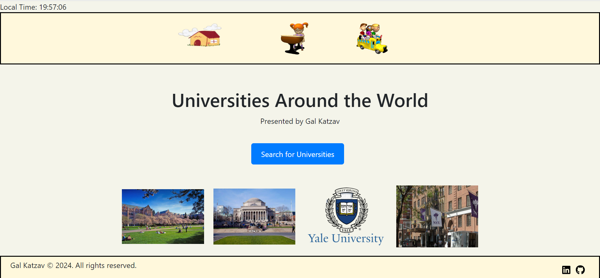
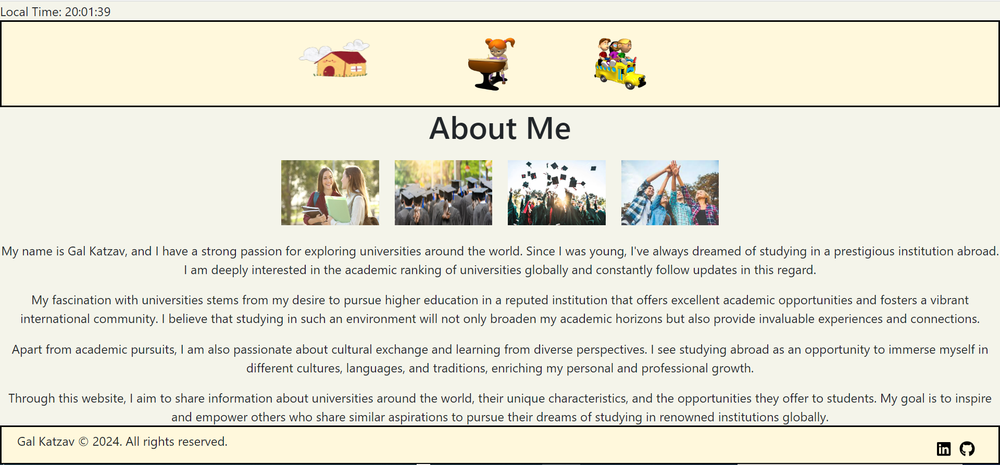
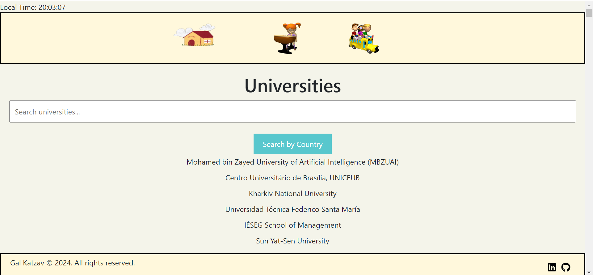
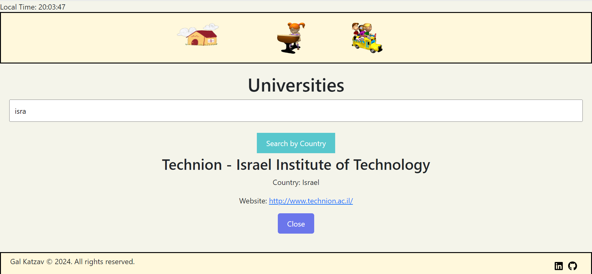
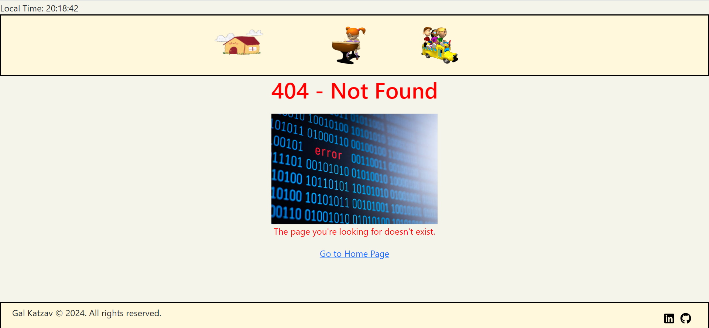

# Universities React Final Project

In the project directory, you can run:

### `npm start`

Runs the app in the development mode.\
Open [http://localhost:3000](http://localhost:3000) to view it in your browser.

The page will reload when you make changes.\
You may also see any lint errors in the console.

add packages we need:

- node models

```sh
npm i
```

- react router dom

```sh
npm i react-router-dom

```

- react icons

```sh
npm install react-icons

```

- bootstrap

```sh
npm install bootstrap@5.3.3

```

## Explanation of the system:

My system gives information about universities around the world, the system was written in react. There are 4 pages in the system:

1. Home Page - login page to the system.
2. About Page - page about. On this page I decided to detail why I decided to choose this topic.
3. World Universities Page - This page loads data from an external API link. On this page you can search for universities by name or by country. You can enter the information about each university separately and see the data there: name of the institution, country and website.
4. Not Found Page - When the user enters an incorrect url or tries to reach a page in the system that does not exist, a page appears with a link to return to the home page.

## System images

- Home Page



- About Page



- World Universities Page



- Search University & Info of a specific university



- Not Found Page


